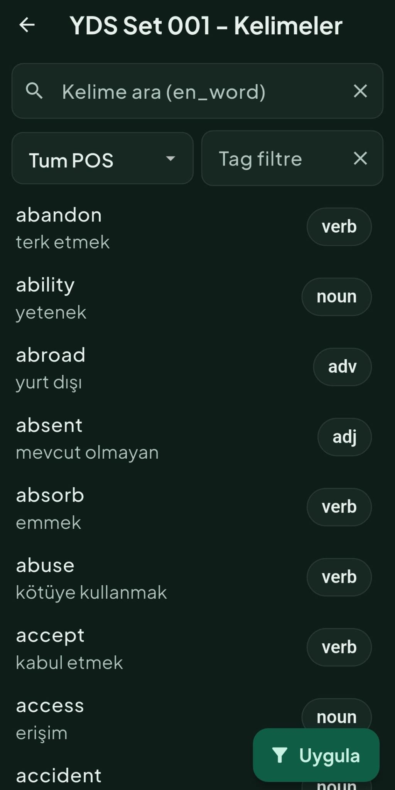
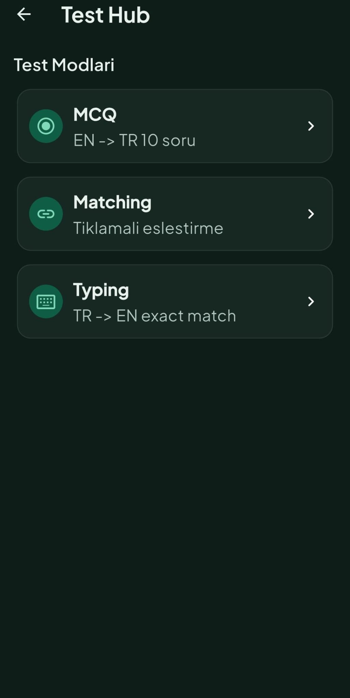
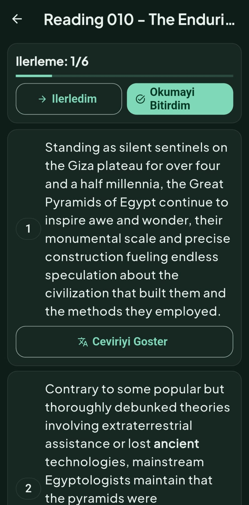
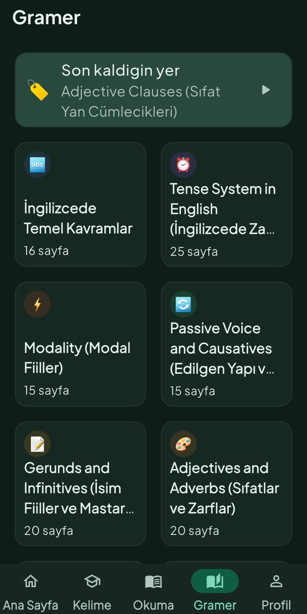
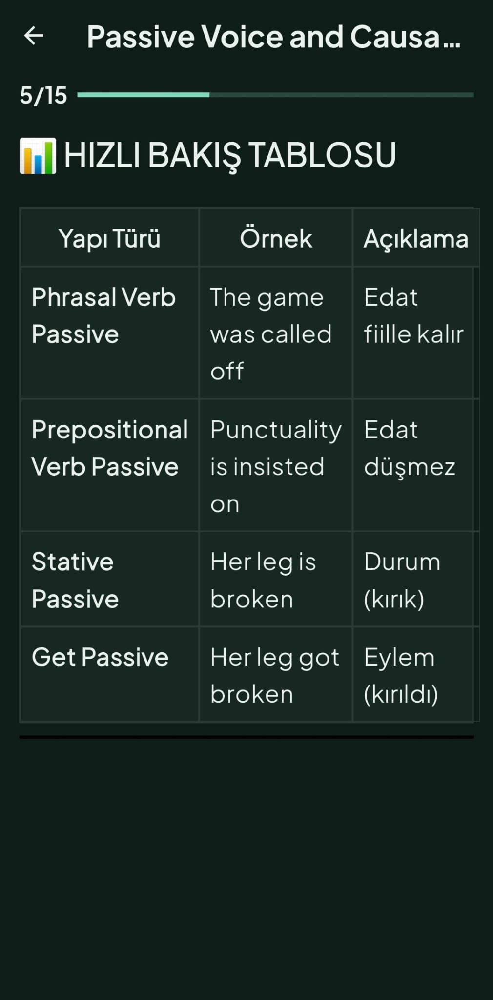

# PASSAGETR (Faz 1-4, Güncel)

Bu repo, Flutter + Supabase tabanlı İngilizce öğrenme uygulamasının güncel sürümünü içerir.
Mevcut kapsam artık yalnızca Faz 1 değil; Faz 2 (reading/çeviri), Faz 3 (dashboard/akış iyileştirmeleri) ve Faz 4 (gramer modülü + content pipeline) dahildir.

PASSAGETR: YDS ve İngilizce öğrenenler için özel olarak tasarlanmış,
zengin okuma parçası koleksiyonuna sahip akıllı öğrenme uygulaması.

📚 500+ Özgün Okuma Parçası
🎯 YDS, YÖKDİL, YDT'ye Özel İçerik
🤖 Akıllı Kelime Çıkarıcı
📊 Detaylı İlerleme Takibi
🎧 Sesli Okuma Desteği
📱 Çevrimdışı Kullanım

Özel Slogan: Reading is Power.

## Kapsam Özeti

- Faz 1: Kelime paketleri, flashcard, test hub, progress takibi
- Faz 2: Reading modülü, çeviri servisleri ve çeviri cache
- Faz 3: Home/dashboard ve gezinme akışı iyileştirmeleri
- Faz 4: Gramer modülü, markdown->json dönüştürme ve Supabase yükleme pipeline'ı

## Mimari ve Teknolojiler

- Framework: Flutter
- State management: Riverpod
- Backend: Supabase
- Render: `flutter_html`, `flutter_html_table`
- Local lightweight state: `shared_preferences`

### Bağımlılık Özeti (`pubspec.yaml`)

| Tür | Paket | Amaç |
|---|---|---|
| dependency | `flutter_riverpod` | Provider/state katmanı |
| dependency | `supabase_flutter` | Auth + DB erişimi |
| dependency | `shared_preferences` | Basit lokal kalıcılık |
| dependency | `flutter_html` | HTML içerik render |
| dependency | `flutter_html_table` | HTML table desteği |
| dependency | `http` | Servis çağrıları |
| dependency | `google_fonts` | Tipografi |
| dev_dependency | `flutter_test` | Test |
| dev_dependency | `flutter_lints` | Lint kuralları |

### Proje Klasör Yapısı (`lib/`)

```text
lib/
|-- main.dart                  # Uygulama giriş noktası, Supabase init
|-- app/                       # MaterialApp, routing ve app-level yapı
|-- core/                      # Ortak altyapı
|   |-- auth/                  # Oturum/anon auth yardımcıları
|   |-- config/                # dart-define / env config okuma
|   |-- constants/             # Uygulama sabitleri
|   |-- services/              # Harici servis katmanı (çeviri vb.)
|   |-- theme/                 # Renk, tipografi, tema tanımları
|   |-- utils/                 # Saf yardımcı fonksiyonlar (levenshtein, lru_cache vb.)
|   `-- widgets/               # Yeniden kullanılabilir UI bileşenleri (shimmer, stat tile vb.)
|-- data/
|   |-- local/                 # Lokal veri kaynakları (Drift/SQLite)
|   `-- repositories/          # Supabase repository implementasyonları
|-- domain/
|   |-- entities/              # İş modeli nesneleri
|   |-- repositories/          # Repository arayüzleri
|   `-- value_objects/         # Value object tipleri
|-- features/                  # Feature-first ekran/modül yapısı
|   |-- bootstrap/             # Açılış/başlatma akışı (branded splash)
|   |-- home/                  # Dashboard
|   |-- shell/                 # Bottom navigation container (badge desteği)
|   |-- packs/                 # Paket listesi
|   |-- words/                 # Kelime liste/detay
|   |-- flashcard/             # Flashcard oturumları
|   |-- tests/                 # MCQ, matching, typing testleri
|   |-- readings/              # Okuma modülü
|   |-- grammar/               # Gramer modülü (modül/sayfa/reader)
|   `-- profile/               # Profil, ayarlar ve tema geçişi
`-- state/                     # Riverpod provider tanımları (domain-split)
    |-- providers.dart         # Barrel export (tüm provider'ları re-export eder)
    |-- auth_providers.dart    # Auth bootstrap, session service
    |-- content_providers.dart # DB init, dictionary bootstrap, app bootstrap
    |-- translation_providers.dart # Çeviri servisi provider
    |-- pack_providers.dart    # Pack listesi, repository
    |-- word_providers.dart    # Kelime sorguları, quick view controller (LRU cache)
    |-- reading_providers.dart # Okuma listesi, detay, cümle çeviri
    |-- grammar_providers.dart # Gramer modül/sayfa provider'ları
    |-- dashboard_providers.dart # Home dashboard metrikleri
    |-- theme_providers.dart   # Tema modu (Light/Dark/System, persist)
    `-- nav_badge_providers.dart # Bottom nav badge sayıları
```

## Kurulum ve İlk Çalıştırma

## 1) Repo kurulum

```bash
git clone <REPO_URL>
cd PASSAGETR
flutter pub get
```

## 2) Konfigürasyon dosyaları

### Flutter app config (`env/app.dev.json`)

```bash
cp env/app.dev.json.example env/app.dev.json
```

`env/app.dev.json` örnek içerik:

```json
{
  "SUPABASE_URL": "https://YOUR_PROJECT_REF.supabase.co",
  "SUPABASE_ANON_KEY": "sb_publishable_xxx",
  "TRANSLATE_PROVIDER": "deepl"
}
```

### Uploader config (`.env`)

```bash
cp .env.example .env
```

`.env` örnek içerik:

```env
SUPABASE_URL=https://YOUR_PROJECT_REF.supabase.co
SUPABASE_SERVICE_ROLE_KEY=sb_secret_xxx
```

Not:
- Mobil uygulama tarafında yalnızca `SUPABASE_ANON_KEY` (`sb_publishable_...`) kullanılmalıdır.
- `SUPABASE_SERVICE_ROLE_KEY` yalnızca script/server tarafında kullanılmalıdır.

## 3) Uygulamayı çalıştırma

Windows (PowerShell script):

```powershell
.\scripts\run_flutter_dev.ps1
```

macOS/Linux veya script kullanmak istemeyenler:

```bash
flutter run --dart-define-from-file=env/app.dev.json
```

## Android Build Gereksinimleri (Repo Gerçeği)

- Java: 17
- Kotlin plugin: `2.2.20` (`android/settings.gradle.kts`)
- Gradle wrapper: `8.14` (`android/gradle/wrapper/gradle-wrapper.properties`)
- Android compile/min/target SDK: Flutter tarafından sağlanır (`flutter.compileSdkVersion`, `flutter.minSdkVersion`, `flutter.targetSdkVersion`)
- NDK: Flutter tarafından sağlanır (`flutter.ndkVersion`)

## Supabase Kurulum Akışı (Kısa)

## 1) Migration uygula

CLI ile:

```bash
supabase db push
```

Alternatif:
- Supabase SQL Editor aç
- `supabase/migrations/*.sql` içeriğini sırayla çalıştır

## 2) RLS mantığı örnek (doğrulanmış desen)

`user_word_progress` için temel politika mantığı:

```sql
create policy progress_select_own on public.user_word_progress
for select to authenticated
using (auth.uid() = user_id);
```

Benzer şekilde insert/update için `with check (auth.uid() = user_id)` uygulanır.

## 3) Örnek veri yükleme (özet)

- Kelime setleri/okuma içerikleri için: `docs/supabase_csv_import.md`, `docs/supabase_readings_import.md`
- Gramer verisi için:
  1. Markdown -> JSON
  2. JSON -> Supabase uploader

## Faz 4 - Gramer Modülü ve Pipeline

- Markdown kaynak klasörü: `docs/gramer`
- Converter: `markdown_to_json_converter.py`
- Uploader: `supabase_uploader.py`
- Migration: `supabase/migrations/202603030005_grammar.sql`
- Flutter ekranları: `lib/features/grammar/`

### Gramer komutları

```powershell
python markdown_to_json_converter.py --input-dir docs/gramer --output-dir json_output
.\scripts\upload_grammar.ps1 -Mode replace -DryRun
.\scripts\upload_grammar.ps1 -Mode replace
```

Alternatif uploader:

```powershell
python supabase_uploader.py --json-file json_output/tum_gramer_modulleri.json --mode replace
```

## UI Akışı (Tutarlı Özet)

1. Açılış/Splash: Supabase bağlantısı kontrol edilir, anonim oturum başlatılır.
2. Paket listesi: Kullanıcı çalışacağı paketi seçer.
3. Kelime listesi: Arama/filtreleme yapılır, buradan **öğrenme oturumu başlatılır**.
4. Flashcard oturumu: Bilme düzeyi işaretlenir, progress güncellenir.
5. Test hub: MCQ / eşleştirme / yazma testleri.
6. Reading: Metin, çeviri ve kelime etkileşimleri.
7. Gramer: Modül listesi -> modül sayfaları -> reader akışı.

### Temsili UI Çizimi (Wireframe)

```text
+-----------------------------------+
| PASSAGETR                         |
+-----------------------------------+
| [Ana Sayfa] [Kelime] [Okuma] [Gramer] [Profil]  <- Bottom Nav
+-----------------------------------+

[KELIME LISTESI]
+-----------------------------------+
| Arama...                    [Filtre]
| Paket: YDS Set 001                |
|-----------------------------------|
| abandon          terk etmek       |
| ability          yetenek          |
| ...                               |
|-----------------------------------|
| [KARTLARLA OGRENMEYE BASLA]       |
+-----------------------------------+

[TEST HUB]
+-----------------------------------+
| < Geri           TEST MERKEZI     |
| [Coktan Secmeli] [Eslestirme] [Yaz]
|-----------------------------------|
| Soru: "ability"                   |
| ( ) mevcut olmayan                |
| (*) yetenek                       |
| ( ) terk etmek                    |
|-----------------------------------|
| [CEVAPLA]                         |
+-----------------------------------+

[READING DETAIL]
+-----------------------------------+
| < Geri          A Day in Paris    |
|-----------------------------------|
| The weather was breathtaking...   |
| [Ceviriyi Goster]                 |
|-----------------------------------|
| Hava ... nefes kesiciydi.         |
+-----------------------------------+

[GRAMER - MODUL LISTESI]
+-----------------------------------+
| < Geri         INGILIZCE GRAMER   |
|-----------------------------------|
| [1] Temel Kavramlar        16 sf  |
| [2] Tense System           25 sf  |
| [3] Modality               15 sf  |
| ...                               |
+-----------------------------------+

[GRAMER - MODUL SAYFALARI]
+-----------------------------------+
| < Geri      Adjectives/Adverbs    |
|-----------------------------------|
| 1) Sifatlar - Tanim ve Turetme    |
| 2) Sifatlarin Sirasi              |
| ...                               |
| 20) Bolum Tarama Testi            |
+-----------------------------------+

[GRAMER - READER]
+-----------------------------------+
| < Geri         Adjectives/Adverbs |
| 3/20  [=========-----]            |
|-----------------------------------|
| Sayfa basligi                     |
| HTML icerik (tablo + metin)       |
|-----------------------------------|
| Ornekler                          |
| Mini Test                         |
+-----------------------------------+
```

## Faz 3 Özet Akışı

- Bottom nav: `Ana Sayfa / Kelime / Okuma / Gramer / Profil`
- Home hızlı başlangıç: `resume reading -> weak words -> random words`
- Reading detail: seçim ve hızlı sözlük etkileşimi
- Gramer reader: modül bazlı sayfa ilerleme akışı

## Test ve Kalite Kontrolleri

```bash
flutter analyze
flutter test
python -m py_compile markdown_to_json_converter.py supabase_uploader.py
```

Not:
- Typing testi Levenshtein mesafe algoritması ile hibrit doğrulama yapar:
  - **Exact match** → tam doğru (yeşil)
  - **Near match** (kısa kelime ≤1 hata, uzun kelime ≤2 hata) → doğru sayılır ama doğru yazılış gösterilir (sarı)
  - **Wrong** → yanlış (kırmızı)
- 18 adet Levenshtein unit test ile doğrulanmıştır.

## Operasyonel Risk Notları

- Anonymous auth hızlı onboarding sağlar; ancak cihaz değişimi/uygulama silme sonrası kullanıcı kimliği taşınamazsa ilerleme geri getirilemeyebilir.
- Public translation fallback endpoint'leri geliştirmede pratik olsa da production için gizlilik, limit ve uptime riskleri barındırır.

## Troubleshooting

| Sorun | Belirti | Kontrol / Çözüm |
|---|---|---|
| Supabase URL/Key eksik | Uygulama Supabase'e bağlanmaz | `SUPABASE_URL` + `SUPABASE_ANON_KEY` değerlerini kontrol et |
| Anonymous provider kapalı | Açılışta anonim oturum oluşmaz | Supabase Dashboard -> Auth -> Providers -> Anonymous aç |
| Android INTERNET izni eksik | `Failed host lookup` / `SocketException` | `AndroidManifest.xml` içinde INTERNET iznini doğrula |
| Translation endpoint yok | Çeviri özelliği çalışmaz | Endpoint tanımla veya fallback davranışını kabul et |

## Android Release Notu (Split APK)

Küçük boyutlu APK (ABI bazlı):

```powershell
flutter build apk --release --split-per-abi --dart-define-from-file=env/app.dev.json
```

## Not: Türkçe Karakterler

Bu README dosyası **UTF-8** kodlaması ile tutulur. Türkçe karakterlerin (ç, ğ, ı, İ, ö, ş, ü) bozulmaması için dosyayı UTF-8 olarak açıp kaydedin.

Kök neden:
- Dosya içeriği UTF-8 olsa bile terminal/editor kodlaması UTF-8 değilse metin bozuk görünür (mojibake).

Kalıcı önlem:
- Repo kökünde `.editorconfig` + `.gitattributes` UTF-8/LF zorlaması vardır.
- Bozukluk denetimi için `python scripts/check_mojibake.py` çalıştırın.
  - Bu komut `README.md`, `docs/**/*.md` ve `lib/**/*.dart` dosyalarını tarar.
- Windows PowerShell'de görüntüleme için UTF-8 kullanın:
  - `chcp 65001`
  - `[Console]::InputEncoding = [System.Text.UTF8Encoding]::new()`
  - `[Console]::OutputEncoding = [System.Text.UTF8Encoding]::new()`
  - `$PSDefaultParameterValues['Out-File:Encoding'] = 'utf8'`

## Faz 3.1 Stabilizasyon Notu

- Bottom nav güncellendi: `Ana Sayfa / Kelime / Okuma / Gramer / Profil`.
- Ayrık `Sözlük` sekmesi kaldırıldı; sözlük araması `Kelime` sekmesindeki birleşik arama kutusuna taşındı.
- Kelime aramasında sonuç kartı varsa iki aksiyon sunulur: `Kelime Kartı` ve `Sözlük`.
- ReadingDetail odak kelimeler paneli varsayılan kapalı gelir; açıldığında EN + TR anlam listelenir.
- Reading quick word popup layoutu taşma yapmayacak şekilde yeniden hizalandı.
- Home/Profile auth akışında anonim session zorunlu hale getirildi; auth hataları kullanıcı dostu Retry mesajı ile gösterilir.

## Faz 3.1 Ek Güncelleme (Kelime/Sözlük Birleşimi + UI Stabilizasyon)

Bu bölüm, mevcut Faz 3.1 notlarına ek olarak son patchlerde gelen davranış güncellemelerini listeler.

### 1) Navigasyon ve Bilgi Mimarisi

- Bottom nav artık 5 sekmelidir: `Ana Sayfa / Kelime / Okuma / Gramer / Profil`.
- Ayrık `Sözlük` sekmesi shell'den çıkarılmıştır.
- Sözlük özelliği kaldırılmadı; `Kelime` sekmesi içinde birleşik arama deneyimine taşındı.

### 2) Kelime Sekmesi (Yeni Birleşik Arama Akışı)

- Kelime sekmesinde üstte tek bir arama kutusu bulunur.
- Boş aramada gereksiz sorgu atılmaz, yönlendirme metni gösterilir.
- Arama sonucu kelime kartında eşleşirse:
  - `Kelime Kartı` aksiyonu ile `WordDetail` açılır.
  - `Sözlük` aksiyonu ile dictionary/fallback sonucu açılır.
- Arama sonucu kelime kartında yoksa:
  - `Sözlük` aksiyonu ile fallback lookup sonucu açılır.
- Kelime sekmesinin altında pack listesi gömülü kalır (`PackListPage(embedded: true)`).

### 3) Auth Stabilizasyonu

- `appBootstrapProvider` auth hatalarını artık swallow etmez.
- Home/Profile veri provider'ları auth session kurulmadan metrik sorgularına geçmez.
- Geçici oturum kopmalarında bir kez otomatik toparlama (retry) uygulanır.
- Kullanıcıya gösterilen hata dili teknik yerine aksiyon odaklıdır (`Retry`).

### 4) Reading Quick Word Popup İyileştirmesi

- Popup üst bölümünde başlık ve etiketler `Column + Wrap` düzenine alınmıştır.
- Uzun kelime ve uzun etiketlerde satır kırılması/overflow riski azaltılmıştır.
- Bulunan kelime kartında `trMeaning` chip satırından ayrılıp ayrı blokta gösterilir.
- Synonym/antonym chip'leri ilişkili kelime veya sözlük fallback akışını tetikleyebilir.
- `Kaynakta Aç` otomatik çalışmaz, sadece butonla dış tarayıcı açılır.

### 5) Reading Odak Kelimeler Paneli

- Panel varsayılan olarak kapalıdır (collapse/expand).
- Panel açıldığında her satırda `EN + TR + POS` bilgisi gösterilir.
- `Kelime Çalış` ve `Mini MCQ` aksiyonları panel açıkken görünür.
- Odak kelimeler mevcut deterministic highlight yaklaşımıyla uyumlu üretilir.

### 6) Sayaç Tutarlılığı

- Pack kartlarında görünen kelime sayısı tek bir kaynak şemasıyla sunulur (`Pack.wordCount`).
- Reading pack kart metni `X kelime` formatına alınmıştır.
- Word ve Reading yüzeyinde aynı pack için aynı sayı gösterilmesi hedeflenmiştir.

### 7) Build Notu (Küçük APK)

Küçük boyutlu arm64 release APK için:

```powershell
flutter build apk --release --target-platform android-arm64 --split-per-abi --dart-define-from-file=env/app.dev.json
```

Beklenen cikti:
- `build/app/outputs/flutter-apk/app-arm64-v8a-release.apk`

## PASSAGETR Marka Geçişi

- Uygulama adı tüm platformlarda `PASSAGETR` olarak güncellendi.
- Uygulama sloganı: `Reading is Power.`
- Flutter package adı: `passagetr`
- Android/iOS/macOS bundle ID ve applicationId bu turda bilinçli olarak **değiştirilmedi**:
  - `com.example.ingilizce_app1`
  - `com.example.ingilizceApp1`

### İkon Kaynağı ve Üretim

- Kaynak ikon: `docs/icon_taslak/flutter/splash.png`
- Proje içi kaynak: `assets/branding/app_icon_source.png`
- İkon üretim komutu:

```bash
dart run flutter_launcher_icons
```

## Screenshots

### 1) Home Dashboard


### 2) Word List


### 3) Test Hub


### 4) Reading Detail


### 5) Grammar Modules


### 6) Grammar Reader


## Faz 5 — Altyapı ve UI İyileştirmeleri (Güncel)

Bu faz, projenin kod mimarisini güçlendiren ve kullanıcı deneyimini iyileştiren değişiklikleri kapsar.

### 5.1 Provider Mimarisi Yeniden Yapılandırma

808 satırlık monolitik `providers.dart` dosyası 8 domain-specific dosyaya bölündü:

| Dosya | İçerik |
|-------|--------|
| `auth_providers.dart` | Auth bootstrap, session service, Supabase client |
| `content_providers.dart` | DB init, dictionary bootstrap, app bootstrap zinciri |
| `translation_providers.dart` | Çeviri servisi provider (configurable fallback) |
| `pack_providers.dart` | Pack listesi, pack repository |
| `word_providers.dart` | Kelime sorguları, quick view controller (LRU cache) |
| `reading_providers.dart` | Okuma listesi/detay, cümle çeviri |
| `grammar_providers.dart` | Gramer modül/sayfa provider'ları |
| `dashboard_providers.dart` | Home dashboard metrikleri |

Mevcut `providers.dart` barrel export dosyası olarak çalışır — tüm import'lar uyumlu kalır.

### 5.2 Typed Exception Sistemi

String-based hata kontrolü (`_isMissingAuthSessionError()`) yerine typed exception hierarchy eklendi:

```dart
sealed class AppException implements Exception { ... }
class AuthMissingException extends AppException { ... }
class NetworkException extends AppException { ... }
```

`SupabaseProgressRepository` ve `DashboardProviders`'da kullanılır.

### 5.3 LRU Cache

`WordQuickViewController._translationCache` artık sınırsız büyümez — `LruCache<String, String>(maxSize: 500)` ile bellek sızıntısı riski ortadan kaldırıldı.

### 5.4 Typing Testi Levenshtein Toleransı

Exact-match yerine hibrit doğrulama sistemi:
- **Exact match** → tam doğru (yeşil SnackBar)
- **Near match** (Levenshtein mesafe ≤ eşik) → doğru sayılır, doğru yazılış sarı SnackBar ile gösterilir
- **Wrong** → yanlış (kırmızı SnackBar)

Eşik değerleri: kısa kelime (≤5 harf) → max 1 hata, uzun kelime (>5 harf) → max 2 hata.

### 5.5 Public Endpoint Güvenliği

`LibreTranslateService._fallbackEndpoints` artık hardcode değil — `AppConfig.allowLibreFallbacks` flag'i ile kontrol edilir (varsayılan: `false`). Production'da fallback'ler kapalıdır.

### 5.6 Lint Kuralları Genişletme

`analysis_options.yaml`'a eklenen kurallar:
- `prefer_const_constructors`
- `avoid_print`
- `always_declare_return_types`
- `unawaited_futures`
- `cancel_subscriptions`

### 5.7 Manuel Tema Değiştirme

Profil sayfasında `SegmentedButton<ThemeMode>` ile Light / Dark / System geçişi. Tercih `SharedPreferences`'da persist edilir — uygulama yeniden başlatıldığında korunur.

### 5.8 Branded Bootstrap Splash

Bootstrap ekranı artık sadece `CircularProgressIndicator` yerine:
- App ikonu + fade-in animasyonu
- Uygulama başlığı + açıklama metni
- `LinearProgressIndicator`
- Hata state'inde stilize ikon + "Tekrar Dene" butonu

### 5.9 Shimmer/Skeleton Loading

Pack listesi ve okuma sayfalarında loading state artık `AppShimmerBlock` / `AppShimmerCard` widget'ları ile gösterilir. Pure-Flutter gradient animasyonu — ek paket gerektirmez.

### 5.10 Bottom Nav Badge

"Kelime" tab'ında zayıf kelime sayısını gösteren `Badge.count` widget'ı eklendi. `weakWordCountProvider` ile reaktif güncellenir.

### 5.11 Offline Dayanıklılık (İnternet Toleransı)

- Uçak modunda veya zayıf ağlarda uygulamanın çökmesi engellendi.
- `AuthSessionService` ağ hatalarını (NetworkException, SocketException) sessizce yakalar.
- Ana sayfa ve profil ekranları, hata anında sıfır metrikli zarif fallback arayüzü sunar.
- Profil sayfasında ağ bağlantısı kurulamadığında "Çevrimdışı mod" ibaresi (chip) gösterilir.

### 5.12 Kelime Arama ve UX İyileştirmeleri

- `WordHomePage` arama çubuğundaki "Temizle" (clear) butonunun görünürlüğü `onChanged` tetikleyicisiyle anında güncellenir.
- Buton davranışlarındaki belirsizlikler ve parametre hataları giderildi.

### 5.13 Çapraz Paket Kelime Paylaşımı (Cross-Pack Words)

- Tüm kelimelerin tek bir pakete ("YDS Set 001") kilitlenmesi sorunu aşıldı.
- `LocalPackRepository` artık paket kelime sayılarını hesaplarken, o paketin **okuma parçalarında (passages) geçen kelimeleri global kelime havuzunda (7000 kelime) arayarak** dinamik bulur.
- In-memory statik cache sayesinde runtime'da yüksek performans sağlar. Artık okuma paketlerinde "0 kelime" yerine gerçek kelime içerik sayıları görülebiliyor.

### 5.14 TTS ile Kelime Seslendirme (Text-to-Speech)

- Uygulamaya `flutter_tts` entegrasyonu eklenmiştir.
- `TtsService` (hız, dil ayarları) ve `ttsServiceProvider` ile global erişim sağlanır.
- `AppSpeakButton` kullanılarak kelime kartları ve detay sayfalarında kelimelerin orijinal (İngilizce) telaffuzları dinlenebilir.

### 5.15 Gramer Offline Modu (Hibrit + Local-first)

- Gramer sekmesi artık yalnızca Supabase'e bağımlı değildir.
- `USE_LOCAL_STATIC_CONTENT=true` modunda önce lokal `app_content.db` kaynakları kullanılır.
- Lokal grammar tabloları:
  - `grammar_modules`
  - `grammar_pages`
  - `grammar_examples`
  - `grammar_tests`
- `HybridGrammarRepository` davranışı:
  - Önce lokalden okur.
  - Lokal boşsa Supabase'den çekip lokale yazar.
  - Ağ/senkron hatası varsa lokal içerikle devam eder.
- `GrammarHomePage` açılışında non-blocking arka plan senkronu (`syncIfStale`) çalışır.

#### Grammar içeriklerini asset'e gömme komutu

```bash
python markdown_to_json_converter.py --input-dir docs/gramer --output-dir json_output
python scripts/build_app_content_db.py --dictionary-xlsx docs/dictionary.xlsx --words-file docs/YDS_Set_001.csv --passages-file docs/readings_passages.csv --sentences-file docs/readings_sentences.csv --grammar-dir docs/gramer --output-db assets/db/app_content.db --report-file json_output/app_content_build_report.json
```

Detaylı döküman: `docs/grammar_offline_mode.md`

---

## Gelecek Fazlarda Geliştirme Önerileri

Aşağıdaki iş kalemleri backend değişikliği, yeni paket veya büyük çaplı refactor gerektirdiği için gelecek sprint'lerde ele alınması planlanmaktadır.

### 1. Hesap Yükseltme — Anonim → Kayıtlı (A3)

**Problem**: `signInAnonymously()` ile oluşan kimlik cihaza bağlıdır. Uygulama silinirse veya cihaz değişirse `user_word_progress`, `user_reading_progress` tablolarındaki tüm ilerleme verisi erişilemez hale gelir.

**Önerilen Çözüm**: Supabase `updateUser()` API'si ile anonim kullanıcıyı e-posta/şifre hesabına bağlama. Profil sayfasına "Hesabını Yükselt" CTA butonu + e-posta/şifre form dialog eklenmesi.

**Gerekli Değişiklikler**:
- `auth_session_service.dart` — `upgradeAnonymousAccount(email, password)` metodu
- Yeni `account_upgrade_page.dart` — e-posta girişi + onay akışı
- Supabase Dashboard — e-posta onay template, redirect URL ayarları

---

### 2. Repository/Provider Unit Test kapsamı ≥%60 (B2)

**Problem**: Mevcut 27 test yalnızca `core/` utility fonksiyonları ve 1 widget smoke test kapsar. Repository ve provider katmanlarında test yok.

**Önerilen Çözüm**: `mocktail` paketi ile mock-based unit testler:
- `SupabaseProgressRepository`: Mock Supabase client ile CRUD testleri
- `homeDashboardProvider`: `ProviderContainer` + overrides ile state testleri
- `BootstrapPage`: Provider override ile widget testleri

**Gerekli Paketler**: `mocktail: ^1.0.0`

---

### 3. Declarative Routing — go_router (B3)

**Problem**: Tüm navigasyon `Navigator.push(MaterialPageRoute(...))` ile yapılıyor. Deep-link desteği, URL-based navigasyon ve guard-based auth kontrolü yok.

**Önerilen Çözüm**: `go_router` paketine geçiş. ~15-20 dosyada `Navigator.push` → `context.go/push` değişikliği gerektirir. `StatefulShellRoute` ile bottom navigation entegrasyonu.

**Tahmini Etki**: Büyük refactor — feature-branch'te yapılması önerilir.

---

### 4. Spaced Repetition — SRS Algoritması (D1)

**Problem**: Kelime tekrarı tamamen rastgele; zorlanılan ve bilinen kelimeler eşit sıklıkta gösteriliyor.

**Önerilen Çözüm**: SM-2 (SuperMemo 2) algoritması ile akıllı tekrar zamanlaması. `user_word_progress` tablosuna `srs_interval_days`, `srs_ease_factor`, `srs_next_review`, `srs_repetitions` alanları eklenmesi.

**Gerekli Değişiklikler**: DB şema migration + yeni `srs_algorithm.dart` + flashcard akışına entegrasyon.

---

### 5. Streak / Günlük Hedef Sistemi (D2)

**Problem**: Kullanıcı motivasyonu için geri bildirim mekanizması yok. Düzenli çalışma teşvik edilmiyor.

**Önerilen Çözüm**: Yeni `user_daily_stats` tablosu ile ardışık çalışma günleri sayacı + günlük kelime/okuma hedefi. Dashboard'da 🔥 streak badge + progress bar.

**Gerekli Değişiklikler**: DB şema (yeni tablo) + `streak_service.dart` + dashboard/profil entegrasyonu.

---

### 6. İstatistik / Analytics Ekranı (D4)

**Problem**: Kullanıcının öğrenme ilerlemesini görselleştiren bir ekran yok.

**Önerilen Çözüm**: `fl_chart` paketi ile haftalık/aylık grafik + en zorlanılan kelimeler listesi. Mevcut `user_word_progress` tablosundan sorgu.

**Gerekli Paketler**: `fl_chart: ^0.69.0`

---

### 7. StateNotifier → Notifier/AsyncNotifier Migrasyonu (D5)

**Problem**: `WordQuickViewController` Riverpod 1.x `StateNotifier` pattern'ı kullanıyor. Riverpod 2.x'te `Notifier`/`AsyncNotifier` öneriliyor.

**Önerilen Çözüm**: `StateNotifier<T>` → `AutoDisposeFamilyAsyncNotifier<T, Arg>` geçişi. `ref` doğrudan class üzerinden erişilebilir hale gelir, manual constructor parametresi kalkır.

**Risk**: API değişikliği tüm tüketici dosyaları etkiler — feature-branch'te yapılmalı.

---

### 8. Drift/SQLite DB Güncelleme Stratejisi Dokümanı (D6)

**Problem**: `assets/db/app_content.db` ve `assets/db/dictionary_local.sqlite` asset olarak gömülü. Bu dosyaların güncelleme stratejisi dokümante edilmemiş.

**Önerilen İçerik**:
- Asset versioning (`pubspec.yaml`'da hash/version tracking)
- Schema migration (Drift `schemaVersion` + `MigrationStrategy`)
- Content update flow (asset vs. cihaz DB version karşılaştırması)
- Remote sync (opsiyonel: Supabase'den diff-based content güncelleme)
- Rollback stratejisi
