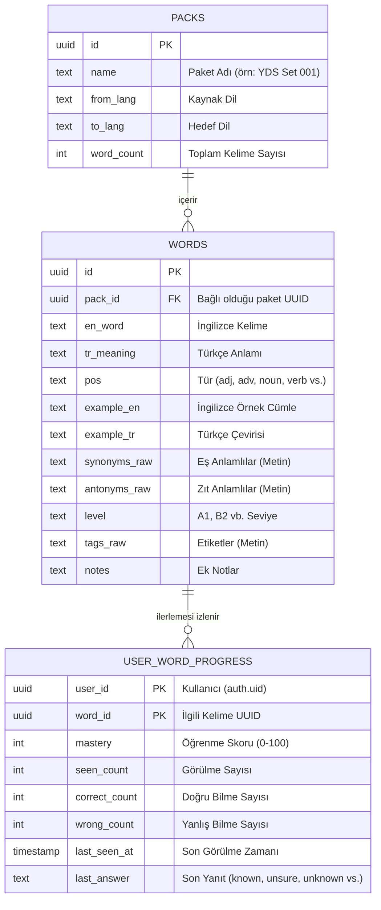

# İngilizce Kelime Öğrenme Uygulaması (Faz 1 MVP)

Bu proje, Flutter ve Supabase kullanılarak geliştirilmiş, etkileşimli ve kapsamlı bir İngilizce kelime öğrenme uygulamasıdır. 

Uygulamanın Faz 1 (MVP) sürümü, belirlenmiş kelime paketleri üzerinden öğrencilerin kelime öğrenmesini, kendini test etmesini ve gelişim süreçlerinin anlık olarak Supabase üzerinde takip edilmesini sağlar.

## 🚀 Proje Senaryosu ve Özellikleri

- **Kelime Paketleri (Packs)**: Öğrenilecek kelimeler belirli setler (örn. YDS Set 001) halinde sunulur.
- **Kelime Listesi ve Sayfalama**: Paket içerisindeki kelimeleri listeleme, büyük veri setleri için sayfalama (pagination) ve sonsuz kaydırma (infinite scroll) desteği.
- **Flashcard ile Öğrenme (Flashcard Session)**: 
  - Kelimelerin İngilizce/Türkçe anlamlarını, türlerini (POS) ve isteğe bağlı detaylarını (eş/zıt anlam, gramer etiketleri) etkileşimli flaş kartlar üzerinden görme.
  - "Biliyorum" (Known), "Emin Değilim" (Unsure) ve "Bilmiyorum" (Unknown) seçenekleriyle anında öz değerlendirme yapma.
- **Test Merkezi (TestHub)**: Öğrenilen kelimeleri pekiştirmek amaçlı 3 farklı entegre test modülü:
  - **Çoktan Seçmeli (MCQ)**: İngilizce kelimeye karşılık gelen doğru Türkçe anlamı veya tam tersini 4 şık arasından seçebilme.
  - **Eşleştirme (Matching)**: Ekrana gelen İngilizce kelimeleri ve Türkçe karşılıklarını tıklayarak birleştirme.
  - **Yazma (Typing)**: Türkçe anlamı verilen kelimenin İngilizcesini klavye ile tam ve doğru bir şekilde yazma (Exact match doğrulaması ile).
- **Gelişim Takibi (Progress Tracking)**: 
  - Her kelime için öğrenme (mastery) oranını hesaplama (0-100 arası derecelendirme).
  - Kullanıcı ilerlemeleri doğrudan ve anlık olarak Supabase veritabanına kaydedilir (`user_word_progress` tablosu üzerinde çalışır).
- **Anonim Giriş (Anonymous Auth)**: Kullanıcılar uygulamayı açtıklarında otomatik olarak (arka planda) hesap oluşturup oturum açarlar. Bu sayede zahmetli kayıt süreçleri olmadan öğrenme verileri güvenli şekilde kendi cihazları ile UID üzerinden kalıcılaştırılır.

## 🏗️ Mimari ve Teknolojiler

Proje, **Feature-First (Özellik Odaklı)** modüler klasör yapısı ve Domain-Driven Design (DDD) prensipleri göz önünde bulundurularak yüksek ölçeklenebilir şekilde tasarlanmıştır.

- **Framework**: [Flutter](https://flutter.dev/) (SDK: >=3.3.0 <4.0.0)
- **State Yönetimi**: [Riverpod](https://riverpod.dev/) (`flutter_riverpod: ^2.5.1`) ile katı bağımlılık enjeksiyonu ve reaktif akış.
- **Backend as a Service (BaaS)**: [Supabase](https://supabase.com/) (`supabase_flutter: ^2.8.4`)
  - Güçlü Postgresql altyapısı, RLS (Row Level Security) korumalı veri okuma/yazma işlemleri, kimlik doğrulama.

### 📁 Proje Klasör Yapısı (`lib/`)

```text
lib/
├── app/          # Ana uygulama widget'ı (MaterialApp vb.) ve genel temalandırma yapılandırmaları.
├── core/         # Uygulama içi konfigürasyon (Env), yardımcı metodlar (utils), hata yönetimi bileşenleri.
├── data/         # Dış dünya / Veritabanı bağlantısı. Data Transfer Object'ler (DTO) ve Supabase Repositories.
├── domain/       # İş kuralları, çekirdek nesneler (Entities: pack, word, user_word_progress) ve abstract Repository arayüzleri.
└── features/     # Uygulamanın birbirinden bağımsız modüler (UI + State) bölümleri:
    ├── bootstrap/  # Açılış ekranı, routing kontrolleri (oturum durumuna göre yönlendirme).
    ├── packs/      # Kelime paketleri listeleme ekranları.
    ├── words/      # Seçili paket içerisindeki kelime listeleri, sayfalama ve arama filtreleri.
    ├── flashcard/  # Kelime öğrenme kartları arayüzü ve oturum yönetimi.
    ├── tests/      # Çoktan Seçmeli (MCQ), Eşleştirme (Matching) ve Yazma (Typing) test araçları.
    └── readings/   # Opsiyonel - İleri aşama okuma metinleri klasörü.
```

### 🗄️ Veritabanı Şeması (Supabase SQL)

Uygulama, verilerini yönetmek için birbiriyle ilişkili temel tabloları kullanır. Aşağıdaki ER diyagramı veri yapısını göstermektedir:



* **Not:** Progress kayıtları, Row Level Security (RLS) kuralları sayesinde sadece giriş yapmış olan ilgili kullanıcı (`auth.uid()`) tarafından okunabilir ve güncellenebilir.

## 🛠️ Kurulum, Gereksinimler ve Çalıştırma

### Ön Koşullar
1. [Flutter SDK](https://docs.flutter.dev/get-started/install)'nız bilgisayarınızda yüklü olmalı.
2. Bir adet aktif Supabase projeniz olmalı. Veritabanında gerekli tabloların (Migration SQL) oluşturulmuş ve içe kelime verisi aktarılmış olması gerekmektedir. 
    - Supabase kurulum talimatları, tablo şemaları ve CSV içe aktarma adımları `docs/supabase_csv_import.md` içerisinde tüm detaylarıyla anlatılmıştır.
3. Supabase gösterge panelinden **Authentication > Providers** menüsüne giderek **Anonymous** giriş türünü mutlaka aktif etmelisiniz. Aksi halde uygulama açılışında kimlik oluşturulamaz.

### Ortam Değişkenleri ile Lokal Çalıştırma
Uygulamanın Supabase ile iletişime geçebilmesi için `SUPABASE_URL` ve `SUPABASE_ANON_KEY` ortam değişkenleri zorunludur.  Projeyi derlerken (veya çalıştırırken) aşağıdaki gibi `--dart-define` parametreleri ile değerleri aktarın:

```bash
flutter run \
  --dart-define=SUPABASE_URL="https://[PROJECT_ID].supabase.co" \
  --dart-define=SUPABASE_ANON_KEY="[YOUR_ANON_KEY]"
```

**Diğer Opsiyonel Yapılandırmalar (Sadece Geliştirme İçin):**
- `--dart-define=ALLOW_DEMO_FALLBACK=true`: Sadece test/geliştirme aşaması için ağ hatası vb. durumlarda sahte bir demo modunu aktif eder.
- `--dart-define=DEMO_USER_UUID="1234..."`: Demo modunda kullanılacak olan sabit sahte UID değeri.
- `--dart-define=USE_PROGRESS_RPC=true`: İlerlemeyi kaydederken istemci tarafındaki (client-side) upsert işlemi yerine Supabase üzerinde tanımlı Server RPC (`apply_flashcard_result`, vb.) metodlarını tetikler.

----
Daha fazla detay, SQL şemaları ve test senaryoları taslakları için projenin `docs/` klasörüne göz atabilirsiniz.

## 📱 Kullanıcı Arayüzü (UI) Akışı ve Temsili Yapı

Uygulamanın arayüzü, kullanıcının kelimeleri öğrenme, tekrar etme, test olma ve yeni metinler okuma süreçlerini kesintisiz ve akıcı bir şekilde tamamlaması için aşağıdaki gibi yapılandırılmıştır:

1. **Açılış/Splash (Bootstrap)**: Supabase bağlantısı kontrol edilir ve kullanıcının anonim oturumu başlatılır.
2. **Paket Seçimi (Packs List)**: Kullanıcı, sistemde tanımlanan setleri (Örn: YDS Set 001) görüntüler ve çalışacağı seti seçer.
3. **Kelime Listesi (Word List)**: Seçilen paketteki kelimelerin listelendiği ana sayfa. Arama, türüne göre filtreleme (noun, verb, vb.) yapılabilir. Üstteki "Öğrenmeye Başla" butonuyla oturum açılır.
4. **Okuma Parçaları (Readings)**: Kelime listesiyle entegre şekilde (sekme veya ayrı navigasyon olarak), kullanıcının o paketteki veya genel konudaki hedef kelimeleri bağlam içinde okuyabildiği ve çevirisini anlık görebileceği ekran.
5. **Flipping Cart (Flashcard)**: Kelimenin ön yüzünde İngilizcesi, arka yüzünde anlamı/detayları yer alır. Kullanıcı, "Bilmiyorum", "Emin Değilim" ve "Biliyorum" butonlarıyla ilerlemesini kaydeder.
6. **Oturum Özeti ve Teste Geçiş**: Flashcard oturumu bitince, sonuç özeti (kaç tanesi bilindi vb.) görüntülenir. Buradan "Test Merkezine (TestHub)" geçiş butonları bulunur.
7. **Test Merkezi (TestHub)**: İlerlemeyi ölçmek için sağlanan MCQ (Çoktan Seçmeli), Eşleştirme (Matching) ve Yazma (Typing) test modülleri sekmeli (TabView) yapıda sunulur.

### Temsili UI Çizimi (Wireframe)

Aşağıdaki taslak, ana ekranların neye benzediğini ve buton yerleşimlerini temsil etmektedir:

```text
+-----------------------------------+
| ⬛ ingilizce_app1                 |
+-----------------------------------+
| 🔍 Kelime Ara...            [Filtre]|
+-----------------------------------+
|                                   |
|  Paketler (Packs)                 |
|  +-----------------------------+  |
|  | YDS Set 001                 |  |
|  | (234 Kelime)          [Seç] |  |
|  +-----------------------------+  |
|                                   |
|  [KELİMELER] |  [OKUMALAR (Read)] | <-- Alt/Üst Navigasyon
|                                   |
|  Seçili Paketin Kelimeleri        |
|  +-----------------------------+  |
|  | abandon          terk etmek |  |
|  | ability             yetenek |  |
|  | ...                         |  |
|  +-----------------------------+  |
|                                   |
|          ( Sonsuz Kaydırma )      |
+-----------------------------------+
|  [ KARTLARLA ÖĞRENMEYE BAŞLA ]    |
+-----------------------------------+


    [FLASHCARD EKRANI - KART ARKASI]
+-----------------------------------+
|               (X) Kapat           |
|                                   |
|    +-------------------------+    |
|    |        abandon          |    |
|    |                         |    |
|    | Type: verb              |    |
|    | Anlam: terk etmek       |    |
|    |                         |    |
|    | Ex: He abandoned it.    |    |
|    | Sy: leave, desert       |    |
|    +-------------------------+    |
|                                   |
|Kendini Değerlendir:               |
| [Bilmiyorum] [Emin Değilim] [Biliyorum]
+-----------------------------------+


          [TEST HUB EKRANI]
+-----------------------------------+
| < Geri         TEST MERKEZİ       |
+-----------------------------------+
| [Çoktan Seçmeli] [Eşleştir] [Yaz] | <-- Sekmeler (Tabs)
+-----------------------------------+
| Soru: "ability"                   |
|                                   |
| ( ) mevcut olmayan                |
| (*) yetenek                       |
| ( ) terk etmek                    |
| ( ) yurt dışı                     |
|                                   |
|                                   |
|          [ CEVAPLA / GEÇ ]        |
+-----------------------------------+


       [READING (OKUMA) EKRANI]
+-----------------------------------+
| < Geri         A Day in Paris     |
+-----------------------------------+
|                                   |
| The weather was absolutely        |
| **breathtaking** as they walked   |
| along the river bank.             |
|                                   |
| [ Çeviriyi Göster (Libre/Google)] |
|                                   |
|-----------------------------------|
|                                   |
| Hava, nehir kıyısında yürürken    |
| kesinlikle **nefes kesiciydi**.   |
|                                   |
+-----------------------------------+
```

## 🚀 Faz 2 Özellikleri (Reading & Çeviri Entegrasyonu)

Faz 2 ile birlikte uygulamaya İngilizce metin okuma, cümle/kelime analizi ve gelişmiş çeviri olanakları eklenmiştir:

- **Okuma Parçaları (Readings)**: İleri aşama İngilizce metin pratikleri (`lib/features/readings`). İçerikler içerisinde geçen hedef kelimelerin uygulamadaki kelimelerle bağlanması hedeflenir.
- **Dinamik Çeviri API'si**: Bilinmeyen cümlelerin bağlamını korumak adına LibreTranslate veya Google Cloud Translation gibi harici servislerle anlık Türkçe çeviri desteği. 
- **Akıllı Önbellek (Translation Cache)**: Yapılan API tabanlı çeviriler Supabase üzerindeki bir çeviri belleği (Örn: `reading_sentence_translations` tablosu) üzerinden saklanarak servis maliyeti düşürülür.
- **Hata Toleransı (Fallback)**: Çeviri uç noktası yapılandırılmazsa (Translation Disabled Modu), sistem kullanıcıya sadece ufak bir bildirim gösterir, uygulamanın çalışmasını engellemez.
- **Yazım Toleransı (Typo Tolerance)**: Gelecek sürümlerde arama ve test bölümleri için hedeflenen gelişmiş matching ve typo-tolerance için veri hazırlıkları yapılır.

## Faz 2 Run Parameters

Faz 1 parametrelerine ek olarak Faz 2 ceviri ayarlari:

```bash
flutter run \
  --dart-define=SUPABASE_URL="https://<project>.supabase.co" \
  --dart-define=SUPABASE_ANON_KEY="<anon-key>" \
  --dart-define=TRANSLATE_PROVIDER="libre" \
  --dart-define=TRANSLATE_ENDPOINT="https://<your-libretranslate-endpoint>" \
  --dart-define=TRANSLATE_API_KEY="<optional-key>"
```

Notlar:
- `TRANSLATE_PROVIDER` su an `libre` varsayilanidir.
- `sentence_tr` doluysa API cagrisi yapilmaz.
- `sentence_tr` bossa API sonucu `reading_sentence_translations` tablosuna cache edilir.

### Faz 2 Ceviri Endpoint Ornekleri

- LibreTranslate endpoint ornegi:
  - `--dart-define=TRANSLATE_PROVIDER="libre"`
  - `--dart-define=TRANSLATE_ENDPOINT="https://libretranslate.example.com"`
  - Servis `/translate` path'i olmadan verilirse app otomatik ekler.

- Google Cloud Translate endpoint ornegi:
  - `--dart-define=TRANSLATE_PROVIDER="google"`
  - `--dart-define=TRANSLATE_ENDPOINT="https://translation.googleapis.com/language/translate/v2"`
  - `--dart-define=TRANSLATE_API_KEY="<google-api-key>"`

### Translation Disabled Modu

- `TRANSLATE_ENDPOINT` bos ise ceviri servisi devre disi kalir.
- UI davranisi:
  - Kullanici `Ceviriyi Goster` butonuna bastiginda
    `Ceviri yapilandirilmadi.` mesaji gorur.
  - Uygulama crash olmaz.

## ⚠️ Android Release APK – Internet & Supabase Notu

Android release APK derlemelerinde Supabase bağlantısının çalışabilmesi için `android/app/src/main/AndroidManifest.xml` dosyasında `<uses-permission android:name="android.permission.INTERNET"/>` izninin mutlaka tanımlı olması gerekir.
Bu izin eksikse uygulama açılır ancak Supabase istekleri `Failed host lookup` veya `SocketException` hatası verir.
Debug ve emulator ortamlarında sorun görünmeyip yalnızca release APK’da ortaya çıkabilir.
APK üretirken `--dart-define=SUPABASE_URL` ve `--dart-define=SUPABASE_ANON_KEY` parametrelerinin boş olmadığından emin olunmalıdır.
Anonymous giriş kullanılıyorsa Supabase Dashboard → Auth → Providers → Anonymous ayarının açık olması gerekir.

## Faz 3 Ozet Akisi

- Bottom nav: `Ana Sayfa / Kelime / Okuma / Profil`
- Home `Hizli Basla` oncelik sirasi: `resume reading -> weak words -> random words`
- ReadingDetail: `selection -> dictionary prefill`, reading progress save, `Bu paragraftan kelimeler` paneli
- Paragraftan kelimeler panelindeki `Kelime Calis` aksiyonu flashcard oturumunu sadece `customWordIds` ile baslatir

## Libre Fallback Endpoint Notu

Libre provider kullanilirken uygulama ana endpoint basarisiz olursa asagidaki public endpointleri sirayla dener:
- https://translate.argosopentech.com/translate
- https://translate.astian.org/translate
- https://libretranslate.pussthecat.org/translate

Ornek:
- --dart-define=TRANSLATE_ENDPOINT="https://translate.argosopentech.com/translate"
- --dart-define=TRANSLATE_ENDPOINT="https://libretranslate.pussthecat.org/translate"

## DeepL (Supabase Edge Function Proxy)

Bu projede DeepL API key istemciye konmaz. Mobil uygulama DeepL'e dogrudan gitmez; `deepl_translate` Edge Function uzerinden cagirir.

### 1) Edge Function Deploy

```bash
supabase functions deploy deepl_translate
```

### 2) Secret Set

```bash
supabase secrets set DEEPL_AUTH_KEY="<YOUR_DEEPL_AUTH_KEY>"
```

Opsiyonel endpoint override (default free):

```bash
supabase secrets set DEEPL_API_URL="https://api-free.deepl.com/v2/translate"
```

### 3) Flutter Run (DeepL)

DeepL icin istemci tarafinda endpoint/key verilmez, sadece provider secilir:

```bash
flutter run \
  --dart-define=SUPABASE_URL="https://<project>.supabase.co" \
  --dart-define=SUPABASE_ANON_KEY="<anon-key>" \
  --dart-define=TRANSLATE_PROVIDER="deepl"
```

Notlar:
- WordQuickViewSheet fallback ceviri bu provider ile otomatik calisir.
- Ceviri hatasinda popup kapanmaz; Retry ve `Kaynakta Ac` kullanilabilir.
