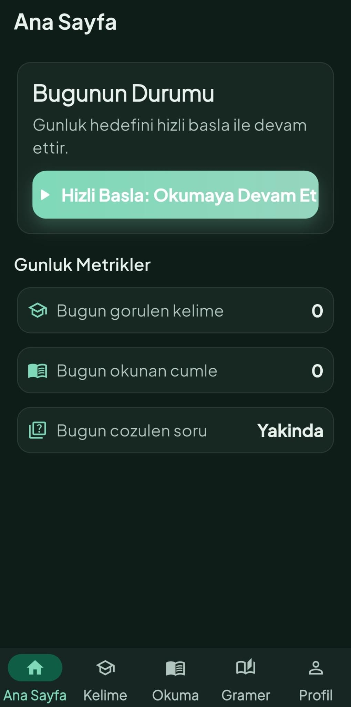

# İngilizce Öğrenme Uygulaması (Faz 1-4, Güncel)

Bu repo, Flutter + Supabase tabanlı İngilizce öğrenme uygulamasının güncel sürümünü içerir.
Mevcut kapsam artık yalnızca Faz 1 değil; Faz 2 (reading/çeviri), Faz 3 (dashboard/akış iyileştirmeleri) ve Faz 4 (gramer modülü + content pipeline) dahildir.

## Kapsam Özeti

- Faz 1: Kelime paketleri, flashcard, test hub, progress takibi
- Faz 2: Reading modülü, çeviri servisleri ve çeviri cache
- Faz 3: Home/dashboard ve gezinme akışı iyileştirmeleri
- Faz 4: Gramer modülü, markdown->json dönüştürme ve Supabase yükleme pipeline'ı

## Mimari ve Teknolojiler

- Framework: Flutter
- State management: Riverpod
- Backend: Supabase
- Render: `flutter_html`, `flutter_html_table`
- Local lightweight state: `shared_preferences`

### Bağımlılık Özeti (`pubspec.yaml`)

| Tür | Paket | Amaç |
|---|---|---|
| dependency | `flutter_riverpod` | Provider/state katmanı |
| dependency | `supabase_flutter` | Auth + DB erişimi |
| dependency | `shared_preferences` | Basit lokal kalıcılık |
| dependency | `flutter_html` | HTML içerik render |
| dependency | `flutter_html_table` | HTML table desteği |
| dependency | `http` | Servis çağrıları |
| dependency | `google_fonts` | Tipografi |
| dev_dependency | `flutter_test` | Test |
| dev_dependency | `flutter_lints` | Lint kuralları |

### Proje Klasör Yapısı (`lib/`)

```text
lib/
|-- main.dart                  # Uygulama giriş noktası, Supabase init
|-- app/                       # MaterialApp, routing ve app-level yapı
|-- core/                      # Ortak altyapı
|   |-- auth/                  # Oturum/anon auth yardımcıları
|   |-- config/                # dart-define / env config okuma
|   |-- constants/             # Uygulama sabitleri
|   |-- services/              # Harici servis katmanı (çeviri vb.)
|   |-- theme/                 # Renk, tipografi, tema tanımları
|   |-- utils/                 # Saf yardımcı fonksiyonlar
|   `-- widgets/               # Yeniden kullanılabilir UI bileşenleri
|-- data/
|   `-- repositories/          # Supabase repository implementasyonları
|-- domain/
|   |-- entities/              # İş modeli nesneleri
|   |-- repositories/          # Repository arayüzleri
|   `-- value_objects/         # Value object tipleri
|-- features/                  # Feature-first ekran/modül yapısı
|   |-- bootstrap/             # Açılış/başlatma akışı
|   |-- home/                  # Dashboard
|   |-- shell/                 # Bottom navigation container
|   |-- packs/                 # Paket listesi
|   |-- words/                 # Kelime liste/detay
|   |-- flashcard/             # Flashcard oturumları
|   |-- tests/                 # MCQ, matching, typing testleri
|   |-- readings/              # Okuma modülü
|   |-- grammar/               # Gramer modülü (modül/sayfa/reader)
|   `-- profile/               # Profil ve debug/ayar ekranları
`-- state/
    `-- providers.dart         # Riverpod provider tanımları
```

## Kurulum ve İlk Çalıştırma

## 1) Repo kurulum

```bash
git clone <REPO_URL>
cd ingilizce_app1
flutter pub get
```

## 2) Konfigürasyon dosyaları

### Flutter app config (`env/app.dev.json`)

```bash
cp env/app.dev.json.example env/app.dev.json
```

`env/app.dev.json` örnek içerik:

```json
{
  "SUPABASE_URL": "https://YOUR_PROJECT_REF.supabase.co",
  "SUPABASE_ANON_KEY": "sb_publishable_xxx",
  "TRANSLATE_PROVIDER": "deepl"
}
```

### Uploader config (`.env`)

```bash
cp .env.example .env
```

`.env` örnek içerik:

```env
SUPABASE_URL=https://YOUR_PROJECT_REF.supabase.co
SUPABASE_SERVICE_ROLE_KEY=sb_secret_xxx
```

Not:
- Mobil uygulama tarafında yalnızca `SUPABASE_ANON_KEY` (`sb_publishable_...`) kullanılmalıdır.
- `SUPABASE_SERVICE_ROLE_KEY` yalnızca script/server tarafında kullanılmalıdır.

## 3) Uygulamayı çalıştırma

Windows (PowerShell script):

```powershell
.\scripts\run_flutter_dev.ps1
```

macOS/Linux veya script kullanmak istemeyenler:

```bash
flutter run --dart-define-from-file=env/app.dev.json
```

## Android Build Gereksinimleri (Repo Gerçeği)

- Java: 17
- Kotlin plugin: `2.2.20` (`android/settings.gradle.kts`)
- Gradle wrapper: `8.14` (`android/gradle/wrapper/gradle-wrapper.properties`)
- Android compile/min/target SDK: Flutter tarafından sağlanır (`flutter.compileSdkVersion`, `flutter.minSdkVersion`, `flutter.targetSdkVersion`)
- NDK: Flutter tarafından sağlanır (`flutter.ndkVersion`)

## Supabase Kurulum Akışı (Kısa)

## 1) Migration uygula

CLI ile:

```bash
supabase db push
```

Alternatif:
- Supabase SQL Editor aç
- `supabase/migrations/*.sql` içeriğini sırayla çalıştır

## 2) RLS mantığı örnek (doğrulanmış desen)

`user_word_progress` için temel politika mantığı:

```sql
create policy progress_select_own on public.user_word_progress
for select to authenticated
using (auth.uid() = user_id);
```

Benzer şekilde insert/update için `with check (auth.uid() = user_id)` uygulanır.

## 3) Örnek veri yükleme (özet)

- Kelime setleri/okuma içerikleri için: `docs/supabase_csv_import.md`, `docs/supabase_readings_import.md`
- Gramer verisi için:
  1. Markdown -> JSON
  2. JSON -> Supabase uploader

## Faz 4 - Gramer Modülü ve Pipeline

- Markdown kaynak klasörü: `docs/gramer`
- Converter: `markdown_to_json_converter.py`
- Uploader: `supabase_uploader.py`
- Migration: `supabase/migrations/202603030005_grammar.sql`
- Flutter ekranları: `lib/features/grammar/`

### Gramer komutları

```powershell
python markdown_to_json_converter.py --input-dir docs/gramer --output-dir json_output
.\scripts\upload_grammar.ps1 -Mode replace -DryRun
.\scripts\upload_grammar.ps1 -Mode replace
```

Alternatif uploader:

```powershell
python supabase_uploader.py --json-file json_output/tum_gramer_modulleri.json --mode replace
```

## UI Akışı (Tutarlı Özet)

1. Açılış/Splash: Supabase bağlantısı kontrol edilir, anonim oturum başlatılır.
2. Paket listesi: Kullanıcı çalışacağı paketi seçer.
3. Kelime listesi: Arama/filtreleme yapılır, buradan **öğrenme oturumu başlatılır**.
4. Flashcard oturumu: Bilme düzeyi işaretlenir, progress güncellenir.
5. Test hub: MCQ / eşleştirme / yazma testleri.
6. Reading: Metin, çeviri ve kelime etkileşimleri.
7. Gramer: Modül listesi -> modül sayfaları -> reader akışı.

### Temsili UI Çizimi (Wireframe)

```text
+-----------------------------------+
| ingilizce_app1                    |
+-----------------------------------+
| [Ana Sayfa] [Kelime] [Okuma] [Gramer] [Profil]  <- Bottom Nav
+-----------------------------------+

[KELIME LISTESI]
+-----------------------------------+
| Arama...                    [Filtre]
| Paket: YDS Set 001                |
|-----------------------------------|
| abandon          terk etmek       |
| ability          yetenek          |
| ...                               |
|-----------------------------------|
| [KARTLARLA OGRENMEYE BASLA]       |
+-----------------------------------+

[TEST HUB]
+-----------------------------------+
| < Geri           TEST MERKEZI     |
| [Coktan Secmeli] [Eslestirme] [Yaz]
|-----------------------------------|
| Soru: "ability"                   |
| ( ) mevcut olmayan                |
| (*) yetenek                       |
| ( ) terk etmek                    |
|-----------------------------------|
| [CEVAPLA]                         |
+-----------------------------------+

[READING DETAIL]
+-----------------------------------+
| < Geri          A Day in Paris    |
|-----------------------------------|
| The weather was breathtaking...   |
| [Ceviriyi Goster]                 |
|-----------------------------------|
| Hava ... nefes kesiciydi.         |
+-----------------------------------+

[GRAMER - MODUL LISTESI]
+-----------------------------------+
| < Geri         INGILIZCE GRAMER   |
|-----------------------------------|
| [1] Temel Kavramlar        16 sf  |
| [2] Tense System           25 sf  |
| [3] Modality               15 sf  |
| ...                               |
+-----------------------------------+

[GRAMER - MODUL SAYFALARI]
+-----------------------------------+
| < Geri      Adjectives/Adverbs    |
|-----------------------------------|
| 1) Sifatlar - Tanim ve Turetme    |
| 2) Sifatlarin Sirasi              |
| ...                               |
| 20) Bolum Tarama Testi            |
+-----------------------------------+

[GRAMER - READER]
+-----------------------------------+
| < Geri         Adjectives/Adverbs |
| 3/20  [=========-----]            |
|-----------------------------------|
| Sayfa basligi                     |
| HTML icerik (tablo + metin)       |
|-----------------------------------|
| Ornekler                          |
| Mini Test                         |
+-----------------------------------+
```

## Faz 3 Özet Akışı

- Bottom nav: `Ana Sayfa / Kelime / Okuma / Gramer / Profil`
- Home hızlı başlangıç: `resume reading -> weak words -> random words`
- Reading detail: seçim ve hızlı sözlük etkileşimi
- Gramer reader: modül bazlı sayfa ilerleme akışı

## Test ve Kalite Kontrolleri

```bash
flutter analyze
flutter test
python -m py_compile markdown_to_json_converter.py supabase_uploader.py
```

Not:
- Typing testi şu an esasen exact-match davranışına yakındır.
- Typo tolerance yardımcı katmanları bazı akışlarda vardır, ancak typing doğrulamasına otomatik geniş tolerans olarak garanti edilmez.

## Operasyonel Risk Notları

- Anonymous auth hızlı onboarding sağlar; ancak cihaz değişimi/uygulama silme sonrası kullanıcı kimliği taşınamazsa ilerleme geri getirilemeyebilir.
- Public translation fallback endpoint'leri geliştirmede pratik olsa da production için gizlilik, limit ve uptime riskleri barındırır.

## Troubleshooting

| Sorun | Belirti | Kontrol / Çözüm |
|---|---|---|
| Supabase URL/Key eksik | Uygulama Supabase’e bağlanmaz | `SUPABASE_URL` + `SUPABASE_ANON_KEY` değerlerini kontrol et |
| Anonymous provider kapalı | Açılışta anonim oturum oluşmaz | Supabase Dashboard -> Auth -> Providers -> Anonymous aç |
| Android INTERNET izni eksik | `Failed host lookup` / `SocketException` | `AndroidManifest.xml` içinde INTERNET iznini doğrula |
| Translation endpoint yok | Çeviri özelliği çalışmaz | Endpoint tanımla veya fallback davranışını kabul et |

## Android Release Notu (Split APK)

Küçük boyutlu APK (ABI bazlı):

```powershell
flutter build apk --release --split-per-abi --dart-define-from-file=env/app.dev.json
```

## Screenshots (Yer Tutucu)

Bu dosyaları siz ekleyeceksiniz:

1. `docs/screenshots/01_home_dashboard.png`  
   Ana Dashboard + Bottom Nav (Gramer sekmesi görünür)
2. `docs/screenshots/02_word_list.png`  
   Kelime Listesi (arama + filtre + öğrenmeye başla)
3. `docs/screenshots/03_test_hub.png`  
   Test Hub (sekmeler görünür)
4. `docs/screenshots/04_reading_detail.png`  
   Reading Detail (çeviriyi göster akışı)
5. `docs/screenshots/05_grammar_modules.png`  
   Gramer Modül Listesi
6. `docs/screenshots/06_grammar_reader.png`  
   Gramer Reader (progress + içerik + mini test)

İsterseniz bu bölümde doğrudan Markdown image link formatına çevirebiliriz:

```md

```

## Faz 3.1 Stabilizasyon Notu

- Bottom nav guncellendi: `Ana Sayfa / Kelime / Okuma / Gramer / Profil`.
- Ayrik `Sozluk` sekmesi kaldirildi; sozluk aramasi `Kelime` sekmesindeki birlesik arama kutusuna tasindi.
- Kelime aramasinda sonuc karti varsa iki aksiyon sunulur: `Kelime Karti` ve `Sozluk`.
- ReadingDetail odak kelimeler paneli varsayilan kapali gelir; acildiginda EN + TR anlam listelenir.
- Reading quick word popup layoutu tasma yapmayacak sekilde yeniden hizalandi.
- Home/Profile auth akisinda anonim session zorunlu hale getirildi; auth hatalari kullanici dostu Retry mesaji ile gosterilir.
